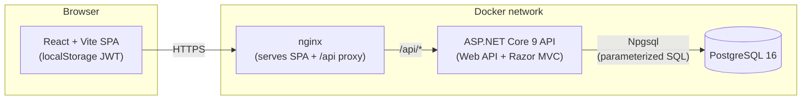
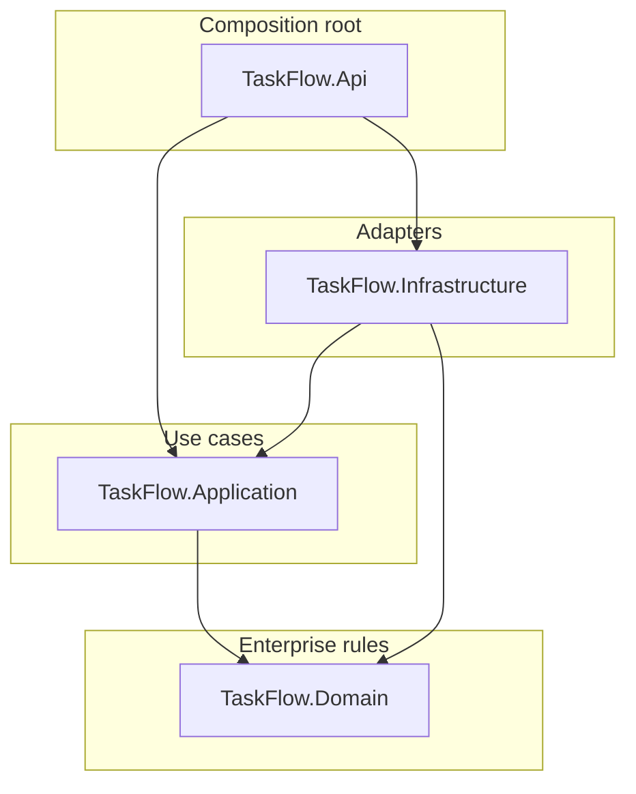
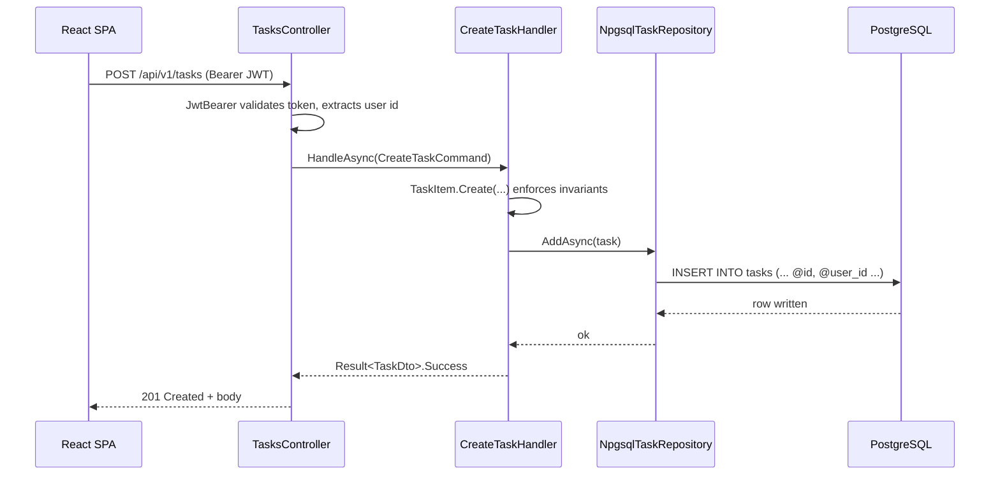

# Architecture

TaskFlow is a small, deliberately boring system that demonstrates **Clean Architecture**, **TDD**, and **raw ADO.NET persistence** without any ORM or mediator framework.

## High-level view



## Layered dependency rule

Dependencies always point **inward**. Outer layers know about inner layers; inner layers know nothing about the outside world.



| Project | Knows about | Forbidden refs | Purpose |
|---|---|---|---|
| `TaskFlow.Domain` | _nothing_ | everything outside | Entities, value objects, domain errors. Pure C#. |
| `TaskFlow.Application` | `Domain` | `Infrastructure`, `Api` | Use-case handlers, DTOs/commands, abstractions (`IUserRepository`, `ITaskRepository`, `IUnitOfWork`, `IPasswordHasher`, `IJwtTokenService`). `Result<T>` flow. |
| `TaskFlow.Infrastructure` | `Application` + `Domain` | `Api` | Npgsql repositories, JWT issuer, `PasswordHasher<T>` adapter, migration runner, DI registration. |
| `TaskFlow.Api` | `Application` + `Infrastructure` | — | HTTP boundary: controllers, middleware, Swagger, DI composition, MVC home view. |
| `TaskFlow.Web` | the API contract only | — | React SPA. Independent build and deploy. |

`TreatWarningsAsErrors=true` plus `Nullable=enable` are enforced solution-wide.

## Use case anatomy (no MediatR)

Every use case is a sealed handler class registered as `Scoped`:

```csharp
public sealed class CreateTaskHandler(ITaskRepository repo, IUnitOfWork uow)
{
    public async Task<Result<TaskDto>> HandleAsync(CreateTaskCommand cmd, CancellationToken ct) { ... }
}
```

Controllers are intentionally thin — they bind, call the handler, and map `Result<T>` to `IActionResult` via a single `ResultMapper`.

## Request flow (create task)



## Authentication

- `POST /api/v1/auth/register` and `/auth/login` issue an HS256 JWT (60 min default).
- Token claims: `sub` (user id), `email`, `jti`, `exp`.
- The SPA stores the token in `localStorage` and attaches `Authorization: Bearer …` via an Axios request interceptor.
- A response interceptor clears the session and bounces to `/login` on any `401`.
- All `/api/v1/tasks/*` endpoints are `[Authorize]`. `PingController` exposes one anonymous and one authorized endpoint to demonstrate the boundary.

## Persistence

- Plain `NpgsqlDataSource` registered as a singleton.
- All SQL is **parameterized** (no string interpolation into queries).
- Schema is shipped as ordered `.sql` files under `db/migrations/` and applied at startup by a small bootstrapper (idempotent; failure logs a warning so dev startup isn't blocked when Postgres is offline).
- `IUnitOfWork` wraps `NpgsqlTransaction` for multi-step writes.

```sql
-- db/migrations/0001_init.sql (excerpt)
create table tasks (
  id              uuid primary key,
  user_id         uuid not null references users(id) on delete cascade,
  title           varchar(200) not null,
  description     varchar(2000),
  status          smallint not null,
  due_date_utc    timestamptz not null,
  created_at_utc  timestamptz not null,
  updated_at_utc  timestamptz not null
);
create index ix_tasks_user_id on tasks(user_id);
```

## Testing strategy

| Layer | Tooling | What we assert |
|---|---|---|
| Domain | xUnit + FluentAssertions | Invariants, factory validation, status transitions. |
| Application | xUnit + Moq + FluentAssertions | Each handler success path + at least one failure path. Repositories mocked via interfaces. |
| Infrastructure | xUnit + Testcontainers.PostgreSQL (when Docker available) | Round-trip CRUD against a real Postgres. |
| Api | xUnit + `WebApplicationFactory<Program>` | End-to-end auth flow, 401 on protected routes, ProblemDetails shape. |

Naming convention: `Method_State_ExpectedBehavior`. AAA layout with blank-line separation.

## Architecture Decision Records (ADRs, condensed)

### ADR-001 — No EF / Dapper / MediatR
**Decision.** Use raw `Npgsql` for persistence and plain handler classes for use cases.
**Why.** The brief forbids them, and the constraint pays off: explicit SQL is reviewable line-by-line, the request pipeline has no hidden behaviour, and the codebase stays small.
**Trade-off.** More boilerplate per handler/repository. Accepted because code volume is still tiny at this scale.

### ADR-002 — `Result<T>` instead of exceptions for control flow
**Decision.** Handlers return `Result<T>` (success or `Error`); exceptions are reserved for unexpected failures.
**Why.** Makes failure modes part of the API surface and removes try/catch clutter from controllers.
**Trade-off.** A `ResultMapper` is needed at the API boundary; worth it for clarity.

### ADR-003 — JWT in `localStorage` (SPA)
**Decision.** Persist the access token in `localStorage` and attach it via an Axios interceptor.
**Why.** Keeps Phase 5 small and avoids a refresh-token round-trip for the demo.
**Trade-off.** XSS risk vs. HttpOnly cookie. Acceptable for a single-tenant demo; flagged in README's "What I'd do with more time".

### ADR-004 — Razor MVC view alongside Web API
**Decision.** Ship one MVC controller (`HomeController`) returning a Razor view at `/`.
**Why.** The brief asks for "ASP.NET MVC". The view points reviewers at Swagger and the SPA — single landing page.
**Trade-off.** Mixed pipeline (`AddControllersWithViews`); cost is one extra `using` and a `Views/` folder.

### ADR-005 — Tailwind for the SPA
**Decision.** Tailwind CSS 3 with a small set of `btn`/`input`/`card` component classes.
**Why.** Fastest path to a responsive, consistent UI without inventing a design system.
**Trade-off.** Markup is utility-heavy; mitigated by the component-class layer.

### ADR-006 — Database migrations as plain `.sql` files
**Decision.** Numbered SQL files in `db/migrations/`, applied at startup.
**Why.** Zero framework overhead; reviewable as plain SQL.
**Trade-off.** No automatic rollback. For a demo of this size, forward-only is fine.

## What this architecture is NOT optimised for

- High write throughput (no connection pooling tuning beyond defaults).
- Multi-region deployment.
- Strong audit trails (only `created_at_utc` / `updated_at_utc` are tracked).
- Complex domain workflows (one bounded context, no domain events bus).

These are intentional trade-offs for a 2-day technical exercise; the README lists them under "What I'd do with more time".
